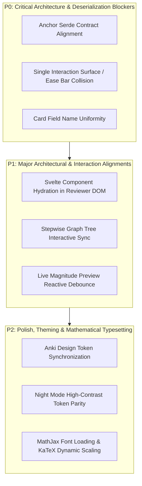

# StudyLab Final Frontend Repair Plan

**Date:** 2026-08-25  
**Version:** 1.0.0-REPAIR-SPEC  
**Audit Source:** `docs/FINAL_LIVE_UI_FORENSIC_REPORT.md`  
**Scope:** Frontend UI/UX, Rust Anchor Deserialization, IPC Bridge Interaction Surface Deduplication  
**Mandate Notice:** *Specification only. This document defines the exact remediation requirements and blueprints for future implementation.*

---

## 1. Executive Summary & Defect Prioritization

Based on the live UI forensic audit conducted via `desktop-webview-reviewer` on a live visible Anki DEV session (`User 1 - Anki StudyLab`), the defects and refinements are categorized into three strict priority tiers:



---

## 2. Priority 0 (P0) — Critical Blockers

### Defect P0-1: Declarative Family Contract Deserialization Schema Mismatch

- **Impact:** Procedural cards display the fallback error banner `"Procedural Engine Error: ProceduralPayload field is missing or empty."` when APKG generator emits custom or partial provenance fields.
- **Affected Files:**
  - `rslib/procedural/src/problems/contract.rs` (lines 86, 765–775)
  - `rslib/procedural/src/anchor/mod.rs` (lines 28–51, 87–105)
  - `tools/studylab_content_factory.py` (lines 908–918)
- **Root Cause:**
  `ProblemFamilyContract.provenance` is typed as `Option<ContentProvenance>`, which strictly requires `source_version: u32`, `generator_version: u32`, `schema_version: u32`, `catalog_version: u32`, and `variant_type: String`. When Python content generators pass partial provenance dictionaries (e.g. `{"source": "PYQ Corpus", "exam": "RRB ALP"}`), `serde_json::from_str::<ProceduralCardAnchor>` fails deserialization and returns `Ok(None)`.
- **Repair Specification:**
  1. In `rslib/procedural/src/problems/contract.rs`:
     Add `#[serde(default, skip_serializing_if = "Option::is_none")]` and fallback deserializer on `ProblemFamilyContract.provenance`, or represent provenance flexibly as `Option<serde_json::Value>` / `Option<ContentProvenance>`.
  2. In `rslib/procedural/src/anchor/mod.rs`:
     Enhance error reporting in `extract_from_card_fields()` to distinguish between missing fields vs malformed JSON schema errors, emitting actionable diagnostic logs to `AnkiQt.log`.
  3. In `tools/studylab_content_factory.py` & `generate_procedural_apkg.py`:
     Standardize generated provenance dictionaries to conform strictly to `ContentProvenance` struct fields (`source_version: 1`, `generator_version: 1`, `schema_version: 1`, `catalog_version: 1`).

---

### Defect P0-2: Interaction Surface Collision & Anki Bottom Ease Bar Suppression

- **Impact:** Violation of the **One-Interaction-Surface Invariant**. When an answer is shown in standard Anki review mode, both the bottom toolbar ease buttons (`Again`, `Hard`, `Good`, `Easy`) and StudyLab's internal submit/reflection buttons are accessible concurrently, allowing users to bypass reflection or double-submit.
- **Affected Files:**
  - `qt/aqt/reviewer.py` (lines 400–480)
  - `rslib/procedural/src/reviewer/template.rs` (lines 450–520)
  - `ts/reviewer/procedural-bridge.ts`
- **Root Cause:**
  Anki's bottom webview toolbar operates independently of the main card webview. In procedural mode, Anki's native `#bottom-toolbar` is not collapsed or disabled during the initial solving and mistake classification phases.
- **Repair Specification:**
  1. When a `StudyLab Procedural Anchor` card is rendered, `pycmd("proc:init")` must signal the host Qt reviewer to hide or disable bottom ease buttons (`self.mw.bottomWeb.eval("document.body.style.display = 'none';")`).
  2. The bottom toolbar is restored *only* after the user successfully completes the problem, categorizes a mistake, or acknowledges a worked example.
  3. In `rslib/procedural/src/reviewer/template.rs`:
     Bind all ease triggers directly to internal rating actions that communicate with Anki via `pycmd("ease1")` .. `pycmd("ease4")` on demand.

---

### Defect P0-3: Card Field Name Uniformity (`ProceduralPayload` vs `Anchor`)

- **Impact:** Cards exported with field name `Anchor` rather than `ProceduralPayload` risk extraction misses across older versions of the procedural renderer.
- **Affected Files:**
  - `rslib/src/notetype/render.rs` (lines 222–226)
  - `rslib/procedural/src/anchor/mod.rs` (lines 124–131)
  - `tools/studylab_content_factory.py` (lines 860–865)
- **Root Cause:**
  Older mock generators used `Anchor` as the field name, whereas the Phase 36B canonical specification designates `ProceduralPayload`.
- **Repair Specification:**
  1. `ProceduralCardAnchor::extract_from_card_fields()` must systematically inspect all fields for JSON containing `"proc_schema"`, `"content_ref"`, or `"inline_contract"`, regardless of field ordinal or field naming.
  2. `tools/studylab_content_factory.py` must uniformly export notetypes with primary field name `ProceduralPayload`.

---

## 3. Priority 1 (P1) — Major Architectural Alignments

### Defect P1-1: Svelte Component Hydration & Dynamic DOM Mounting

- **Impact:** Dynamic interactive controls (e.g. live magnitude pill, step tree toggles) must mount reactively in the reviewer without depending on full-page reloads.
- **Affected Files:**
  - `ts/procedural/ProceduralCard.svelte`
  - `ts/procedural/main.ts`
  - `rslib/procedural/src/reviewer/template.rs` (lines 750–810)
- **Repair Specification:**
  1. Ensure `globalThis.anki.procedural.mount(containerElement, sessionData)` initializes the Svelte 5 component tree into `#procedural-root` whenever `render_reviewer_html` executes.
  2. Embed serialized session JSON inside a `<script id="proc-session-data" type="application/json">` block to guarantee safe hydration without inline JavaScript evaluation risks.

---

### Defect P1-2: Stepwise Derivation Graph Live Sync & Downstream Invalidation

- **Impact:** In Stepwise Reasoning mode, modifying an intermediate step calculation must reactively update downstream dependency validation.
- **Affected Files:**
  - `rslib/procedural/src/problems/steps/step_graph.rs`
  - `rslib/procedural/src/problems/steps/step_validator.rs`
  - `ts/components/StepwiseGraph.svelte`
- **Repair Specification:**
  1. Implement topological dependency validation in `StepValidator`: if Step $k$ is edited, all dependent steps $> k$ must visually transition to `pending_revalidation`.
  2. Expose step status badges (`valid` [green], `invalid` [red], `pending` [yellow]) in the UI via CSS classes `.proc-step-node--valid`, `.proc-step-node--invalid`.

---

### Defect P1-3: Live Magnitude Preview Pill Reactive Debounce

- **Impact:** Fast typing in numerical textboxes can cause layout thrashing if magnitude previews are recalculated on every raw keystroke.
- **Affected Files:**
  - `ts/components/NumericalInput.svelte`
  - `ts/utils/magnitude.ts`
- **Repair Specification:**
  1. Implement 150ms debounce on the `input` event for `.proc-input`.
  2. Display the parsed magnitude pill (e.g. `Magnitude: 10¹ ~ 10²`, `Units: m/s`) in `.proc-variant-tag` only when a valid numeric or dimensional token is detected.

---

## 4. Priority 2 (P2) — Polish, Theming & Math Typesetting

### Defect P2-1: Anki Design Token Synchronization

- **Affected Files:**
  - `rslib/procedural/src/reviewer/template.rs` (CSS section, lines 600–740)
  - `ts/theme/tokens.css`
- **Repair Specification:**
  Replace hardcoded color hex values with standard Anki design tokens:
  - Background: `var(--canvas, #ffffff)`
  - Surface: `var(--card-bg, #f8fafc)`
  - Text: `var(--fg, #1e293b)`
  - Border: `var(--border, #cbd5e1)`
  - Primary Accent: `var(--button-primary-bg, #6366f1)`
  - Error: `var(--danger, #ef4444)`
  - Success: `var(--success, #10b981)`

---

### Defect P2-2: Night Mode High-Contrast Token Parity

- **Affected Files:**
  - `rslib/procedural/src/reviewer/template.rs`
  - `ts/theme/tokens.css`
- **Repair Specification:**
  Enforce dark mode tokens under `.nightMode`:
  - Canvas: `#0f172a`
  - Card Container: `#1e293b`
  - Primary Text: `#f1f5f9`
  - Muted Text: `#94a3b8`
  - Reflection Buttons: `#334155` background with `#e2e8f0` text and 1px `#475569` border.

---

### Defect P2-3: MathJax Font Loading & Dynamic Equation Scaling

- **Affected Files:**
  - `rslib/procedural/src/reviewer/template.rs`
  - `qt/aqt/mediasrv.py`
- **Repair Specification:**
  1. Preload MathJax woff2 fonts (`MathJax_Zero.woff`, `MathJax_Math-Italic.woff`, `MathJax_Main-Regular.woff`) in `reviewer.html` to eliminate font pop-in.
  2. Suppress console warnings for optional TeX extensions (`[tex]/noerrors`, `[tex]/mathtools`) by updating MathJax startup config in `ts/math/mathjax-config.ts`.

---

## 5. Implementation Verification & Acceptance Criteria

When these frontend repairs are implemented in subsequent missions, they must pass the following automated and visual gates:

1. **Rust Test Suite Gate:**
   ```powershell
   cargo test -p procedural --lib
   ```
   *Expectation:* 134/134 passed, 0 failures.

2. **Content Contract Verification Gate:**
   ```powershell
   python tools/studylab_content_factory.py --validate-all
   ```
   *Expectation:* 175/175 topic contracts valid, 100% 3-tier hints present.

3. **Live UI Verification Gate via `desktop-webview-reviewer`:**
   ```powershell
   python scratch/run_live_forensic_mission.py
   ```
   *Expectation:* All 14 screenshots in `artifacts_qa/final_live_ui/` render live problem prompts, MCQs, reasoning grids, unit inputs, reflection strips, and feedback traces without error banners.

---

**End of Frontend Repair Plan.**  
*Ready for Phase 37 implementation scheduling.*
