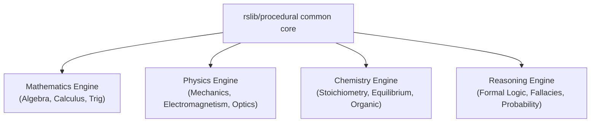

# Procedural Practice Engine Architecture (Phase 1)

> [!NOTE]
> This section describes the procedural content architecture. It does not define the canonical StudyLab Source APKG contract.

This document describes the architectural foundation for the Procedural Practice Engine subsystem in Anki, enabling procedural problem generation and skill-level mastery tracking across multiple domains (**Mathematics**, **Physics**, **Chemistry**, and **Reasoning**).

---

## 1. Crate Location & Isolation

### Location
The procedural subsystem is implemented as an isolated Rust workspace crate located at:
`rslib/procedural/`

Registered in the root [Cargo.toml](file:///c:/Users/Suraj/Documents/Antigravity/Anki-maths/Cargo.toml):
```toml
[workspace]
members = [
  ...
  "rslib/procedural",
  ...
]
```

### Why it is Isolated
1. **Safety & Stability**: Upstream Anki code, collection database logic, and synchronization algorithms remain strictly untouched.
2. **Independent Lifecycle**: The procedural engine can be evolved, refactored, or extended without introducing regressions to Anki's flashcard review pipelines.
3. **No Schema Contamination**: Anki's `collection.anki2` schema and migrations are not polluted with domain-specific learning graphs or attempt logs.
4. **Removability**: The entire procedural subsystem and its database can be removed or disabled at any time without data loss or corruption in the Anki collection.

---

## 2. Database Architecture (`procedural.db`)

### Persistence Location
The procedural subsystem stores its state in a dedicated local SQLite database:
`procedural.db`

- By default, it resides alongside user profiles/collection files (e.g. `<profile_dir>/procedural.db`) or custom directory path passed to [`ProceduralStore::open(path)`](file:///c:/Users/Suraj/Documents/Antigravity/Anki-maths/rslib/procedural/src/storage/store.rs).
- For unit and integration tests, in-memory instances are opened via `ProceduralStore::open_in_memory()`.

### Versioned Migrations
The database maintains an independent `schema_migrations` table tracking all schema changes:

```sql
CREATE TABLE IF NOT EXISTS schema_migrations (
    version INTEGER PRIMARY KEY,
    description TEXT NOT NULL,
    applied_at INTEGER NOT NULL
);
```

### Core Schema Tables (Migration 001)
- **`skills`**: Discrete skill nodes (ID, domain, name, description, prerequisites list, metadata).
- **`skill_states`**: Learner mastery tracking (mastery score, confidence, attempts, last practice time, custom state payload).
- **`problem_families`**: Generator families defining problem templates, parameter schemas, and difficulty ranges.
- **`schemas`**: Procedural practice object schemas referenced by cards.
- **`problem_instances`**: Generated problem records with seeds, evaluated parameters, and answer keys.
- **`practice_attempts`**: Practice log records (score, user answer, response time, Anki card ID reference).
- **`error_events`**: Diagnostic error taxonomy records classified per attempt.

---

## 3. Anki Card to Schema Bridge (Anchor Model)

The relationship between Anki and the Procedural engine follows the **Anchor Model**:

| Layer | Responsibility | Persistence |
| :--- | :--- | :--- |
| **Anki Card** | Memory / Spaced-Repetition Anchor (FSRS / SM-2 scheduling) | `collection.anki2` (cards table) |
| **Procedural Schema** | Canonical Learning Object & Skill Definition | `procedural.db` (schemas table) |
| **Problem Instance** | Ephemeral concrete generated exercise | `procedural.db` (problem_instances table) |

### Anchor Metadata Format
An Anki card links to a procedural schema via minimal metadata stored in note fields or custom properties:

```json
{
  "proc_schema": "math.algebra.monic_quadratic",
  "difficulty_override": 1.5,
  "seed_mode": "random"
}
```

The [`ProceduralCardAnchor`](file:///c:/Users/Suraj/Documents/Antigravity/Anki-maths/rslib/procedural/src/anchor/mod.rs) struct safely parses and extracts these references without modifying Anki card field semantics or database tables.

---

## 4. What Remains Untouched in Anki

The following Anki core subsystems remain completely unmodified:
- **Collection Schema**: Zero table additions or column alterations in `collection.anki2`.
- **FSRS / SM-2 Schedulers**: All scheduling algorithms, card intervals, review queues, and ease calculations remain 100% upstream-identical.
- **Revlog Semantics**: Anki's review log is untouched; detailed practice telemetry is stored exclusively in `procedural.db`.
- **AnkiWeb Sync**: Sync protocols, payloads, and cloud sync logic are untouched.
- **Card Reviewer GUI**: Reviewer frontend code remains unmodified in Phase 1.

---

## 5. Multi-Domain Engine Boundaries (Roadmap)

The common procedural layer is domain-agnostic and parameter-driven. Future domain engines interface through standard schemas:



Each future domain engine supplies:
1. **Generator Templates**: Mapping `ProblemFamily.template_ref` to deterministic AST/parameter evaluators.
2. **Evaluators & Parsers**: Step-by-step validator checking student input against symbolic/numerical solutions.
3. **Diagnostic Classifiers**: Classifying misconceptions into `ErrorEvent` categories.
